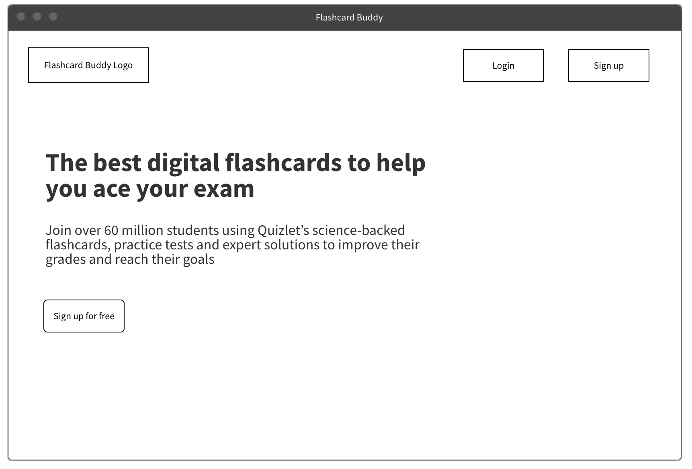
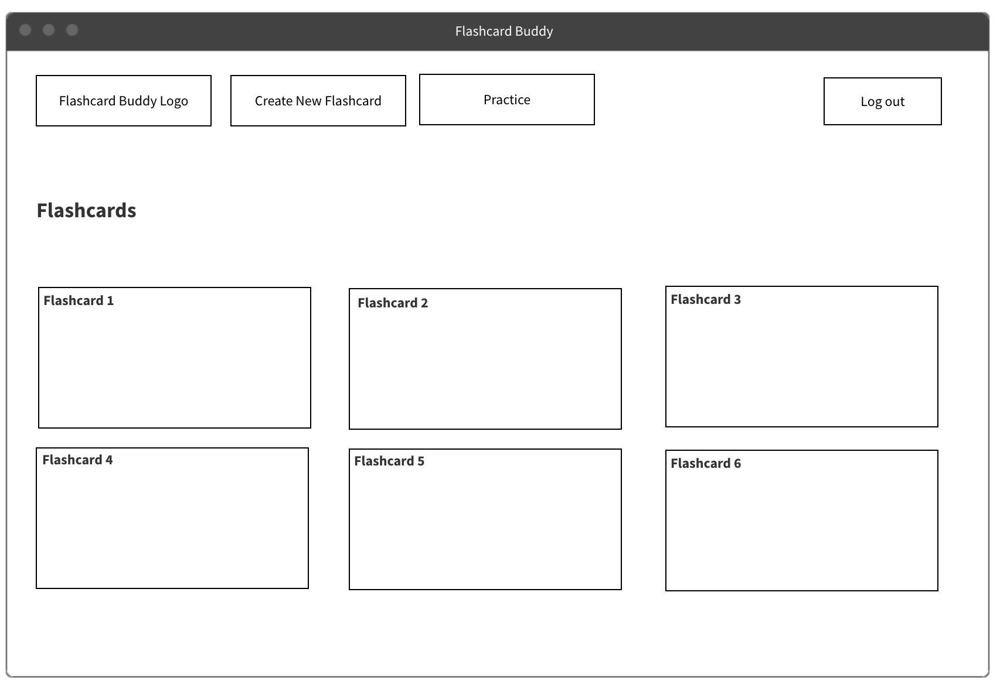
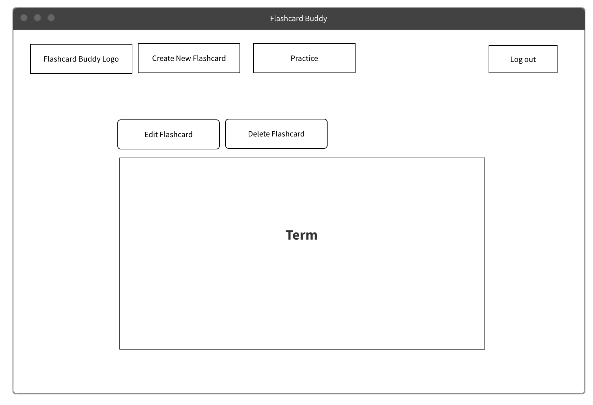
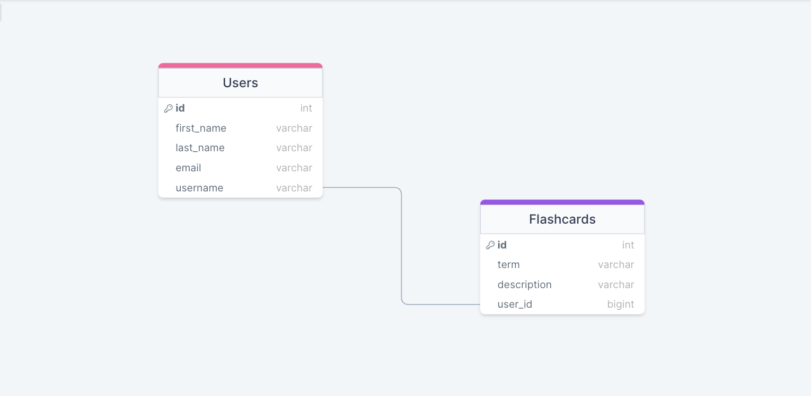

## Flashcard Buddy Read Me

### Description of the app:

FLashcard Buddy is the easiest way to study, practice and become an expert in whatever you’re learning. Create flashcards, memorize vocabulary, get familiar with key concepts that you're trying to learn; and drill practice problems before test day.

### Link to planning Trello board

[Trello Board](https://trello.com/invite/b/15lEia0J/ATTI4d3fa41a5d8a2b8bac89ce25f9febd9468A013A2/project-2)

## Mockups

